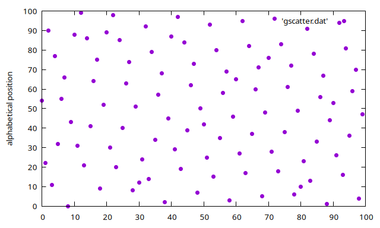
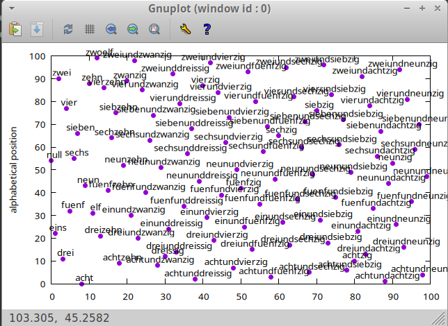
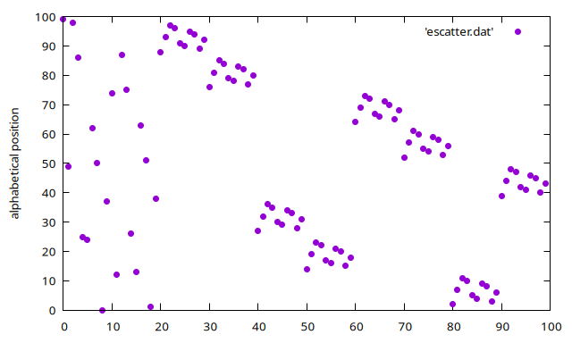
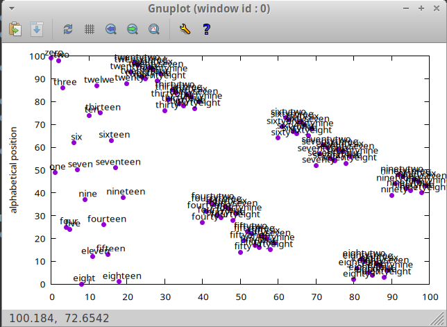

# getting limo
I'm sorry, but I like to use my toy language. You can rewrite it in python, if you want to.
To execute it with limo, get it on github: [limo](https://github.com/mokrates/limo)

# wtf?

People were wrong on the [facebook](https://www.facebook.com/groups/journalofscientificshitposting/posts/3562273530653324?comment_id=3562857307261613&reply_comment_id=3565074887039855), so duty called.


# plotting the german

```bash
limo numberwords-distrib-deutsch.limo > gscatter.dat
gnuplot
echo "set ylabel 'alphabetical position'; plot 'gscatter.dat' using 2:3 pt 7 notitle;" | gnuplot -persist
	
# or, with labels
echo "set ylabel 'alphabetical position'; plot 'gscatter.dat' using 2:3 pt 7 notitle, '' using 2:3:1 with labels offset 0.5,0.5 notitle;" | gnuplot -persist
```




# plotting the english

```bash
limo numberwords-distrib-'english.limo > escatter.dat
gnuplot
echo "set ylabel 'alphabetical position'; plot 'escatter.dat' using 2:3 pt 7 notitle;" | gnuplot -persist
	
# or, with labels
echo "set ylabel 'alphabetical position'; plot 'escatter.dat' using 2:3 pt 7 notitle, '' using 2:3:1 with labels offset 0.5,0.5 notitle;" | gnuplot -persist
```




